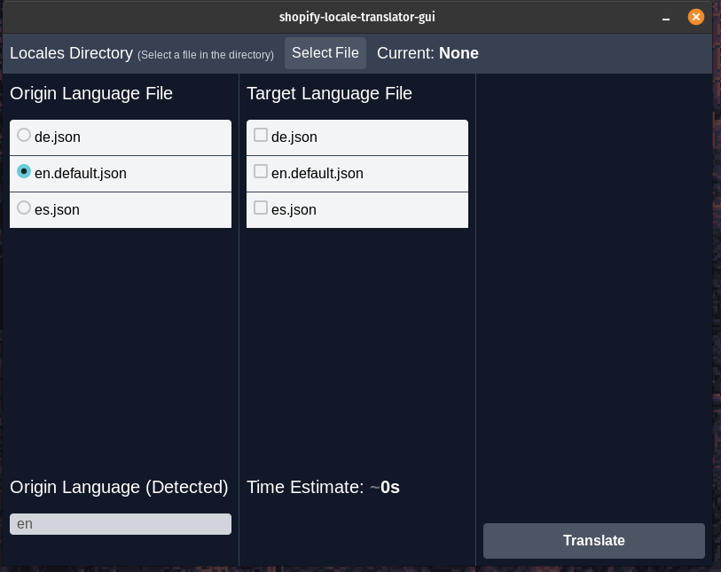

# Shopify Locale Translator

This is a tool to translate JSON locale files for Shopify themes. It can be used
as a CLI tool, a GUI tool, or as a library. Source code and instructions are in
this repository in the [cli](./cli), [core](./gui) and [gui](./gui)
directories.

Here's a screenshot of the GUI tool:

All code is licensed under the [GPLv3](./COPYING.md) license. 